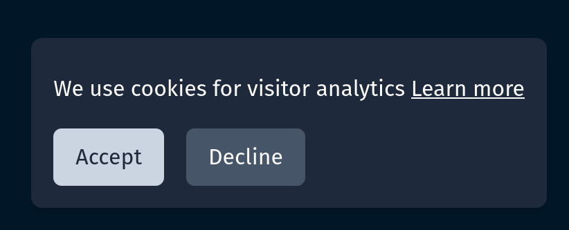

I wanted to implement some sort of analytics in my website that's built with Astro. The use case is really simple, I just want to notify the user that the site uses analytics and they can choose to either accept or decline that. Since I live in EU this is extra important due to the GDPR regulations. I chose Posthog as an analytics solution and this post demonstrates how I implemented the cookie toast in my site. While helpful, don't consider this as legal advice and a ready made solution.

## The implementation

Here's a screenshot of the final outcome



So nothing too fancy but also it looks simple and elegant. And the best thing is of course that you can customize it however you want. In my mind this is way better that some ready made cookie-cutter solution, at least for such a simple use case as this.

Here's the code for the template part of the component

```astro
---

---

<div
  id="cookie-consent"
  class="fixed bottom-4 right-2 md:right-4 z-50 bg-slate-800 text-white p-4 rounded-lg shadow-md"
  style="display: none;"
>
  <p>
    We use cookies for visitor analytics <a
      href="/privacy"
      class="text-white underline">Learn more</a
    >
  </p>
  <div class="flex space-x-4 pt-2">
    <button
      class="bg-slate-300 text-slate-800 px-4 py-2 rounded-md"
      id="cookie-accept-button">Accept</button
    >
    <button
      class="bg-slate-600 text-white px-4 py-2 rounded-md"
      id="cookie-decline-button">Decline</button
    >
  </div>
</div>

```

As you can see from the `style="display: none"` attribute the component is hidden by default. The important thing is that the user needs to either accept or decline the cookie consent before I can toggle on the analytics. This needs to be the case even though the user navigates to different part of the site, I still need to show the toast. But how can we get it to show when needed? This is where I used Astro's `ViewTransitions` and `astro:page-load` (docs [here](https://docs.astro.build/en/guides/view-transitions/#astropage-load)).

After you enable `ViewTransitions` in your Astro app you can use the `astro:page-load` event that will fire every time the user opens another page. This is how I use those events

```astro
<script>
  // ...

  document.addEventListener("astro:page-load", () => {
    addEventListeners();
    handleCookiePreferences();
  });

  function addEventListeners() {
    document
      .querySelector("#cookie-accept-button")
      ?.addEventListener("click", () => {
        saveCookiesAllowed(true);
        handleCookiePreferences();
      });

    document
      .querySelector("#cookie-decline-button")
      ?.addEventListener("click", () => {
        saveCookiesAllowed(false);
        handleCookiePreferences();
      });
  }

  // ...
</script>
```

So here you can see that every time the user goes to another page, I make sure the accept and decline buttons will have event listeners and they will do the corresponding actions. `saveCookiesAllowed` will save the setting to `localStorage`

```astro
<script>
  // ...

  function saveCookiesAllowed(allow: boolean) {
    const consent: CookieConsentStore = {
      consentSet: true,
      cookiesAllowed: allow,
    };

    console.log("saving cookie consent", consent);

    localStorage.setItem("cookie-consent", JSON.stringify(consent));
  }

  // ...
</script>

```

Finally we can just read the value from localStorage and update Posthog analytics as needed

```astro
<script>
  // ...

  function handleCookiePreferences() {
    const consent = JSON.parse(
      localStorage.getItem("cookie-consent") ?? "null"
    ) as CookieConsentStore | null;

    if (!consent || !consent.consentSet) {
      console.log("no consent, opt out of capturing");
      window.posthog.opt_out_capturing();
      displayCookieToast();
      return;
    }

    if (consent.cookiesAllowed) {
      console.log("opting in to analytics");
      window.posthog.opt_in_capturing();
    } else {
      console.log("opting out of analytics");
      window.posthog.opt_out_capturing();
    }

    hideCookieToast();
  }

  // ...
</script>
```

And that's it, now we are not violating our user's privacy!

## Conclusion

This was a small walkthrough of how I created a custom cookie consent toast in my website. Please refer to my Github repo for the [full source code](https://github.com/markusryoti/markusryoti.dev/blob/fdb319ef28e9a635e395abe26ac4c217c2e72b3d/src/components/Cookies.astro)
