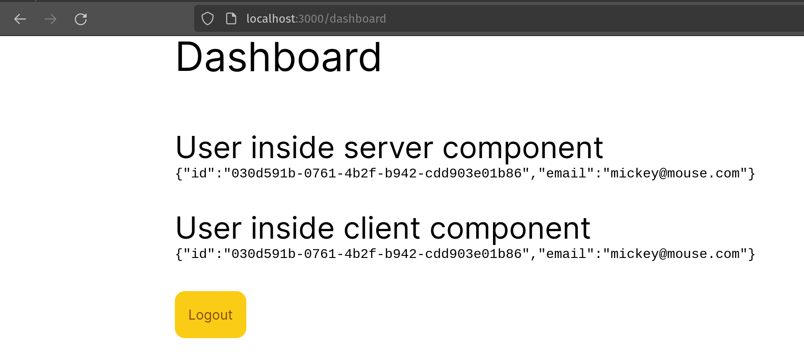
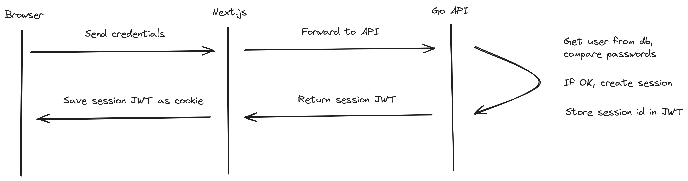

There are a lot of good existing solutions for authentication in a Next.js project like Auth.js, Lucia or Clerk, just to name a few. However at least to me it feels like most of them really focus on the framework you're using and in this case Next.js. But what if I want to have a separate backend written with Go? Ideally I would want to use session based authentication and manage my sessions in my Go backend. With Auth.js I could use the `CredentialsProvider` and use JWT's with my backend, but that would mean that my sessions would be hosted by the Next.js application (although I could share the database between my Next.js app and my Go backend). With Lucia it would be something similar and I would also need to create some sort of custom JWT's for authorizing with my Go backend.

I could just use a provider like Clerk that has good SDK's for both. But with Clerk I would want to modify a lot of their ready made components and it feels like at that point they defeat their purpose. Other providers like Auth0 have pricing tiers that make me a bit hesitant (although probably my apps won't ever have that amount of users anyway...). Could I just build a simple mechanism by myself? Sure, and you can find the code from [Github](https://github.com/markusryoti/go-nextjs-auth). Also a disclaimer, even though I think this is a reasonable approach for small apps don't take this as a production ready example. Also the [Copenhagen Book](https://thecopenhagenbook.com/) book was a really great reference, check it out!

Here's a small demo page of the application


## Architecture overview

In a nutshell, this is the basic flow/architecture of my solution



To be more specific, these are the steps that will happen when logging in:

1. User sends credentials from browser to Next.js backend using server actions.
2. Next.js server sends the credentials to the Go backend.
3. Go backend checks for the user and compares the password hashes. If something goes wrong, error is returned.
4. If all goes well a new session is created and saved to session store. Session has an expiration time set as well.
5. The backend signs a new JWT that will be returned to the client. The expiration time is set the as for the session.
6. JWT is returned to the Next.js server. For added security the Next.js server can verify the JWT with a secret/key.
7. Next.js server saves the JWT as a cookie to the client. The cookie expiration time is read from the JWT.

## Go API

Let's highlight a few things. For this example I used the Fiber framework and I separated most of the auth logic to it's own package. Here's a snippet from registering a user

```go
const (
	SessionExpiryTime = 30 * 24 * time.Hour
	ArgonTime         = 2
	ArgonMemory       = 19 * 1024
	ArgonKeyLen       = 32
)

var mySigningKey = []byte("verysecret")

type TokenResponse struct {
	AccessToken string `json:"accessToken"`
}

func RegisterUser(email, password string) (TokenResponse, error) {
	var res TokenResponse

	existing, err := store.UserStore.GetUserByEmail(email)
	if err != nil && !errors.Is(err, store.ErrUserNotFound) {
		return res, err
	}

	if existing != nil {
		return res, errors.New("user already found")
	}

	salt := generateSalt()

	hashedBytes := argon2.IDKey([]byte(password), salt, ArgonTime, ArgonMemory, 1, ArgonKeyLen)

	hashedPassword := string(hashedBytes)

	user, err := store.UserStore.SaveUser(email, hashedPassword, string(salt))
	if err != nil {
		return res, err
	}

	sessionId := genSessionId()
	expiryTime := time.Now().Add(SessionExpiryTime)
	store.SessionStore.AddSession(sessionId, user, expiryTime)

	token, err := generateAccessToken(sessionId, expiryTime)
	if err != nil {
		return res, err
	}

	res.AccessToken = token

	return res, err
}
```

All in all, there's nothing too crazy going on. I used Argon algorithm for the password crypto operations and I created an memorystore for storing the sessions. Login code is really similar, please refer for the repo for that.

For the authenticated routes I use a middleware that checks if the token is valid

```go
func authenticated(c fiber.Ctx) error {
	headers := c.GetReqHeaders()

	authHeaders, ok := headers["Authorization"]
	if !ok {
		return c.Status(fiber.StatusUnauthorized).SendString("no authorization headers")
	}

	if len(authHeaders) != 1 {
		return c.Status(fiber.StatusBadRequest).SendString("bad number of auth headers")
	}

	authHeader := authHeaders[0]

	parts := strings.Split(authHeader, "Bearer ")
	if len(parts) != 2 {
		return c.Status(fiber.StatusUnauthorized).SendString("invalid auth header")
	}

	token := parts[1]

	claims, err := auth.ValidateToken(token)
	if err != nil {
		return c.Status(fiber.StatusUnauthorized).SendString(err.Error())
	}

	c.Locals("claims", claims)

	return c.Next()
}
```

The code for validating the token is also pretty straight forward

```go
func ValidateToken(token string) (MyCustomClaims, error) {
	parsedToken, err := jwt.ParseWithClaims(token, &MyCustomClaims{}, func(token *jwt.Token) (interface{}, error) {
		return mySigningKey, nil
	})
	if err != nil {
		return MyCustomClaims{}, err
	}

	claims, ok := parsedToken.Claims.(*MyCustomClaims)
	if !ok {
		return MyCustomClaims{}, errors.New("couldn't parse custom claims")
	}

	return *claims, nil
}
```

There's also a method for getting the information from the current user.

```go
type CurrentUserResponse struct {
	User        *internal.User `json:"user"`
	AccessToken *string        `json:"accessToken"`
}

func GetCurrentUser(sessionId string) (*CurrentUserResponse, error) {
	session, err := store.SessionStore.GetSession(sessionId)
	if err != nil {
		return nil, err
	}

	if session.Expired() {
		return nil, errors.New("session expired")
	}

	then := session.ExpiresAt.Add(-SessionExpiryTime / 2)

	var accessToken string

	if time.Now().After(then) {
		newExpiry := time.Now().Add(SessionExpiryTime)

		session.ExpiresAt = newExpiry
		store.SessionStore.UpdateExpiration(sessionId, newExpiry)

		accessToken, err = generateAccessToken(sessionId, newExpiry)
		if err != nil {
			return nil, err
		}
	}

	res := &CurrentUserResponse{
		User:        session.User,
		AccessToken: &accessToken,
	}

	return res, nil
}
```

The cool thing here is that it will also increase the expiry time for the session. That way the active users will have a session that is kept alive, but once they become inactive, those sessions will expire.

## Next.js

The most interesting things happen in the Server Actions, so let's focus on those. Here's a snippet of registering

```typescript
export async function register(formData: FormData) {
  const rawData = Object.fromEntries(formData);

  const res = await fetch("http://localhost:5000/register", {
    method: "POST",
    headers: {
      "Content-Type": "application/json",
    },
    body: JSON.stringify(rawData),
  });

  if (!res.ok) {
    throw new Error("couldn't register user");
  }

  const { accessToken } = await res.json();

  const verifyResult = await verifyToken(accessToken);

  cookies().set({
    name: "session",
    value: accessToken,
    httpOnly: true,
    path: "/",
    expires: verifyResult.expiresAt,
  });

  redirect("/dashboard");
}
```

This will just send the email and password to the Go API. It will return the JWT token and based on that it will set the cookie with the correct expiry time. Here's a snippet of the verify function

```typescript
"use server";

import jwt from "jsonwebtoken";

const secret = "verysecret";

type Claims = {
  session: string;
  exp: number;
};

export async function verifyToken(rawToken: string) {
  const payload = jwt.verify(rawToken, secret);
  const { session, exp } = payload as Claims;

  const expiresAt = exp * 1000;

  return { session, expiresAt };
}
```

So here it will verify the JWT with the same secret as in our Go API. In production you probably don't want to do it this way but rather use public keys instead. I then created a really simplified `useAuth` hook that I can use in my client components

```typescript
import { useState, useEffect } from "react";
import { User, getCurrentUser } from "../actions/actions";

export default function useAuth() {
  const [user, setUser] = useState<User>();

  useEffect(() => {
    getCurrentUser().then((res) => setUser(res));
  }, []);

  return {
    user,
  };
}
```

With that getting the user information is as simple as this

```typescript
"use client";

import useAuth from "../hooks/useAuth";

export default function ClientCard() {
  const { user } = useAuth();

  return (
    <div>
      <h2 className="text-4xl">User inside client component</h2>
      <pre>{JSON.stringify(user)}</pre>
    </div>
  );
}
```

For server-side it's even simpler because I can just call the `getCurrentUser` function

```typescript
import { getCurrentUser } from "../actions/actions";

export default async function ServerCard() {
  const data = await getCurrentUser();

  return (
    <div>
      <h2 className="text-4xl">User inside server component</h2>
      <pre>{JSON.stringify(data)}</pre>
    </div>
  );
}
```

## Conclusion

While of course simplified and not fully production ready, I think this example provides a reasonable approach for smaller apps. An even more so it can help to understand what some of these auth libraries and solutions are doing behind the scenes. Hope you found this helpful and please refer to the [Github Repo](https://github.com/markusryoti/go-nextjs-auth) for the full source code
